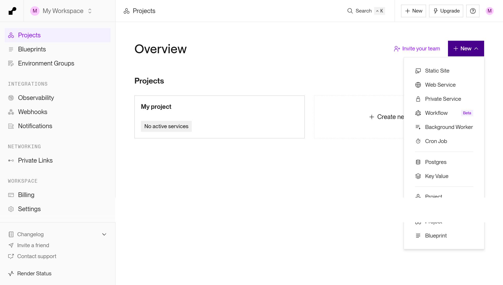
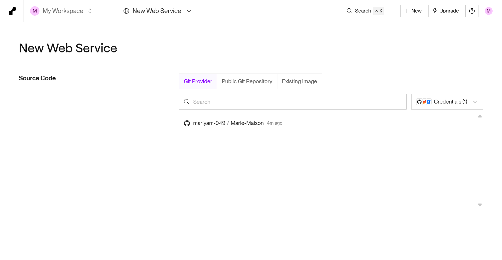
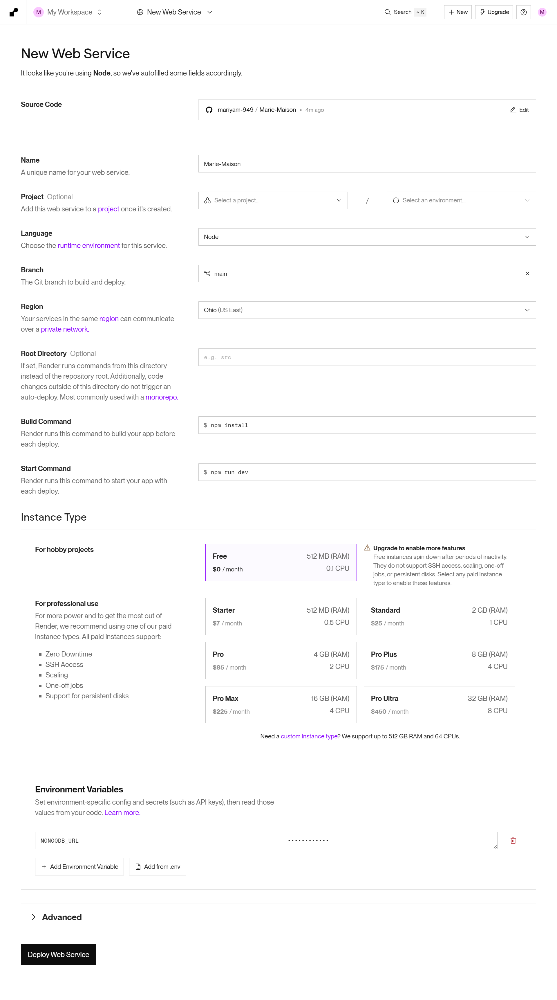
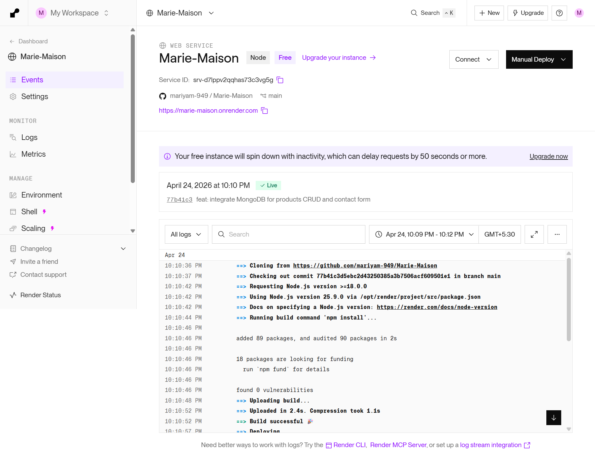

# Marie Maison — Full-stack Jewelry Website

> A complete full-stack e-commerce application built for a university assignment — luxury jewelry store powered by Node.js, Express, and MongoDB Atlas.

- 🌐 **Live Site:** [marie-maison.onrender.com](https://marie-maison.onrender.com)
- 💻 **Source Code:** [github.com/mariyam-949/Marie-Maison](https://github.com/mariyam-949/Marie-Maison)

---

## Tech Stack

| Layer | Technology |
|-------|-----------|
| Backend | Node.js + Express |
| Database | MongoDB Atlas + Mongoose |
| Frontend | HTML / CSS / Vanilla JavaScript |
| Hosting | Render |

---

## Project Structure

```
marie-maison-fullstack/
├── server.js               # Express entry point
├── db.js                   # MongoDB Atlas connection
├── package.json
├── .env                    # MONGODB_URL (not committed to git)
├── README.md
├── models/
│   ├── products.js         # Mongoose Product model
│   ├── category.js         # Mongoose Category model
│   └── contact.js          # Mongoose Contact model
├── routes/
│   ├── products.js         # /api/products — full CRUD
│   ├── categories.js       # /api/categories
│   ├── cart.js             # /api/cart endpoints
│   └── contact.js          # /api/contact form submission
└── public/                 # Static frontend served by Express
    ├── index.html          # Home page
    ├── shop.html           # Shop — loads products via fetch
    ├── product.html        # Product detail page
    ├── cart.html           # Cart view
    ├── admin.html          # Admin panel — add / edit / delete products
    ├── about.html
    ├── contact.html
    ├── css/
    │   └── style.css
    ├── js/
    │   └── app.js          # Shared header / footer / cart helpers
    └── images/             # Product & category images
```

---

## Run Locally

**Requirements:** Node.js 18+

### 1. Clone the repository

```bash
git clone https://github.com/mariyam-949/Marie-Maison.git
cd Marie-Maison
```

### 2. Install dependencies

```bash
npm install
```

### 3. Create `.env` file

```env
MONGODB_URL="mongodb+srv://<user>:<password>@cluster.mongodb.net/mariemaison"
```

### 4. Start the server

```bash
npm start
```

Open [http://localhost:3000](http://localhost:3000) in your browser.

---

## API Documentation

Base URL (local): `http://localhost:3000`  
Base URL (live): `https://marie-maison.onrender.com`

---

### Products

| Method | Endpoint | Description |
|--------|----------|-------------|
| GET | `/api/products` | List all products — optional `?cat=rings` filter |
| GET | `/api/products/:id` | Get single product by ID |
| POST | `/api/products` | Create a new product |
| PUT | `/api/products/:id` | Update an existing product |
| DELETE | `/api/products/:id` | Delete a product |

**POST / PUT Request Body:**
```json
{
  "name": "Solitaire Étoile Ring",
  "sku": "MM-R-001",
  "category": "rings",
  "price": 2450,
  "image": "/images/ring-01.jpg",
  "material": "18k Yellow Gold, 0.75ct Diamond",
  "description": "A single brilliant-cut diamond cradled in 18k yellow gold."
}
```

**GET Response Example:**
```json
[
  {
    "id": 1,
    "sku": "MM-R-001",
    "name": "Solitaire Étoile Ring",
    "category": "rings",
    "price": 2450,
    "image": "/images/ring-01.jpg",
    "material": "18k Yellow Gold, 0.75ct Diamond",
    "description": "A single brilliant-cut diamond cradled in 18k yellow gold."
  }
]
```

---

### Categories

| Method | Endpoint | Description |
|--------|----------|-------------|
| GET | `/api/categories` | List all categories |

**Response Example:**
```json
[
  {
    "slug": "rings",
    "label": "Rings",
    "href": "/shop.html?cat=rings",
    "image": "/images/cat-rings.jpg",
    "alt": "Rings"
  }
]
```

---

### Cart

| Method | Endpoint | Description |
|--------|----------|-------------|
| GET | `/api/cart` | View cart with product details and total |
| POST | `/api/cart` | Add item to cart |
| DELETE | `/api/cart/:productId` | Remove a single item |
| DELETE | `/api/cart` | Empty the entire cart |

**POST Request Body:**
```json
{
  "productId": 1,
  "quantity": 2
}
```

**GET Response Example:**
```json
{
  "items": [
    {
      "productId": 1,
      "quantity": 2,
      "product": { "name": "Solitaire Étoile Ring", "price": 2450 },
      "subtotal": 4900
    }
  ],
  "total": 4900,
  "count": 2
}
```

---

### Contact

| Method | Endpoint | Description |
|--------|----------|-------------|
| POST | `/api/contact` | Save contact form submission to MongoDB |

**POST Request Body:**
```json
{
  "name": "Jane Doe",
  "email": "jane@example.com",
  "subject": "Enquiry about rings",
  "message": "I would like to know more about your collection."
}
```

**Success Response:**
```json
{
  "message": "Message received successfully"
}
```

---

### Health Check

| Method | Endpoint | Description |
|--------|----------|-------------|
| GET | `/api/health` | Returns server status and timestamp |

**Response:**
```json
{
  "status": "ok",
  "service": "Marie Maison API",
  "time": "2026-04-24T10:00:00.000Z"
}
```

---

## Frontend ↔ Backend Wiring

| Page | API Calls |
|------|-----------|
| `index.html` | `GET /api/categories`, `GET /api/products` (featured 4) |
| `shop.html` | `GET /api/products?cat=` |
| `product.html` | `GET /api/products/:id` |
| `admin.html` | `GET / POST / PUT / DELETE /api/products` |
| `cart.html` | `GET / POST / DELETE /api/cart` |
| `contact.html` | `POST /api/contact` |

---

## Deployment Steps (Render)

### Step 1 — Login and create a Web Service



Go to [render.com](https://render.com) and login or sign up with your GitHub account. Click **New → Web Service**.

---

### Step 2 — Connect your GitHub repository



Select your Git provider and choose the **Marie-Maison** repository you want to deploy.

---

### Step 3 — Configure project settings and environment variables



Fill in the project details:
- **Build Command:** `npm install`
- **Start Command:** `npm start`
- Under **Environment Variables**, add `MONGODB_URL` with your MongoDB Atlas connection string
- Select your plan and click **Deploy**

---

### Step 4 — Deployment complete



Render will install dependencies, start your server, and deploy the app. Once done your site is live. Every push to your GitHub `main` branch triggers an automatic redeploy.

---

## MongoDB Collections

| Collection | Documents | Description |
|------------|-----------|-------------|
| `products` | 40 | Full jewelry catalog — 8 per category |
| `categories` | 5 | Rings, Necklaces, Earrings, Bracelets, Anklets |
| `contacts` | — | Contact form submissions |

---

## Learning Resources
- Youtube
- AI Agents
- [Express.js Documentation](https://expressjs.com/)
- [Mongoose Documentation](https://mongoosejs.com/docs/)
- [MongoDB Atlas Getting Started](https://www.mongodb.com/docs/atlas/getting-started/)
- [Render Deployment Guide](https://render.com/docs/deploy-node-express-app)
- [MDN Fetch API](https://developer.mozilla.org/en-US/docs/Web/API/Fetch_API/Using_Fetch)
- [dotenv npm package](https://www.npmjs.com/package/dotenv)

---

## Author

**Mariyam Younas**  
University Assignment — Full-stack Web Development  
[github.com/mariyam-949](https://github.com/mariyam-949)